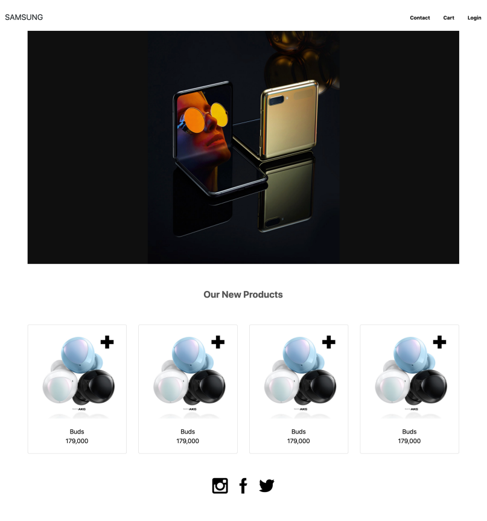

# 0208 Web Practice

## Bootstrap Grid System & Responsive Web 활용


## 🎈 요구 사항

---

제공된 이미지 `01_result.png`, `02_result.png`, `03_result.png`를 참고하여 `shop.html`과 `shop.css`를 작성하시오.

1. 주어진 주석에 맞게 각 요소 (nav, section, article, footer) 안에 코드를 작성하시오

2. 모든 이미지 요소는 images 폴더에 담긴 이미지 파일을 활용합니다

3. 네이게이션 바는 항상 브라우저 화면 최상단에 고정되어 있습니다

4. 상품 정보가 담긴 카드들은 다음의 조건을 따릅니다

   - 카드들이 이동하지 않지만, hyper link의 형태를 띕니다
   - Viewport 너비가 768px 미만인 경우, 행당 1개의 카드가 제시됩니다
   - 너비가 768px 이상, 992px 미만인 경우, 행당 2개의 카드가 제시됩니다
   - 너비가 992px 이상인 경우, 행 당 4개의 카드가 제시됩니다

5. Footer의 아이콘을 클릭하면 해당하는 SNS의 메인 페이지로 이동합니다

6. 예시 이미지

   


## 🎈 반응형 웹 (Responsive web)이란?

---

PC, Mobile, 혹은 Tablet과 같은 다양한 디바이스의 각기 다른 화면 크기에서 원활하게 렌더링되는 웹 페이지를 뜻합니다. 반응형으로 설계하면, 어떤 디바이스에서 어떤 방식으로 접속하든지 웹 사이트의 일관성을 유지할 수 있고 사용성과 기능성을 높입니다.

더 나아가 '좋은' 반응형 웹이란 데스크탑과 모바일이 단순히 화면 크기만 다른 것이 아니라 둘을 이용하는 소비자의 태도도 다르다는 점을 인식하고 이를 반영하는 것입니다.

HTML5, CSS3에 의해 지원되는 미디어 쿼리는 반응형 웹의 핵심 기술이다. 이보다 더 간단하고 편리하게 반응형 웹 사이트를 개발할 수 있게 HTML, CSS, JavaScript가 구상한 프레임워크가 BootStrap이다.


## 🎈 완성 코드

---

```html
<!DOCTYPE html>
<html lang="en">
<head>
  <meta charset="UTF-8">
  <meta name="viewport" content="width=device-width, initial-scale=1.0">
  <link rel="stylesheet" href="shop.css">
  <link href="https://cdn.jsdelivr.net/npm/bootstrap@5.1.3/dist/css/bootstrap.min.css" rel="stylesheet" integrity="sha384-1BmE4kWBq78iYhFldvKuhfTAU6auU8tT94WrHftjDbrCEXSU1oBoqyl2QvZ6jIW3" crossorigin="anonymous">
  <!-- Bootstrap Icon Install -->
  <link rel="stylesheet" href="https://cdn.jsdelivr.net/npm/bootstrap-icons@1.8.1/font/bootstrap-icons.css">
  <title>0208 Web Practice</title>
</head>

<body>
  <!-- nav -->
  <nav class="navigation sticky-top d-flex justify-content-between align-items-center navbar navbar-expand-lg navbar-light" style="background-color: white;">
      <!-- brand -->
      <a class="fs-5 navbar-brand mx-0" href="#">SAMSUNG</a>
      <!-- navbar list -->
      <div class="nav-links">
        <a class="nav-links-item text-decoration-none fw-bold text-dark px-2" href="#">Contact</a>
        <a class="nav-links-item text-decoration-none fw-bold text-dark px-2" href="#">Cart</a>
        <a class="nav-links-item text-decoration-none fw-bold text-dark px-2" href="#">Login</a>
      </div>
    </div>
  </nav>

  <div class="container">
    <!-- section -->
    <section>
      
    </section>

    <!-- article -->
    <article class="text-center">
      <div class="fs-4 fw-bold my-5" style="color: rgb(73, 73, 73);">Our New Products</div>
    </article>

    <!-- grid system -->
    <div class="grid mb-5">
      <!-- size 기준
               <  576px None
        Small  >= 576px sm
        Medium >= 768px md
        Large  >= 992px lg 
      -->
      <!-- md 해상도 전까지 카드 행당 1개, lg 해상도 전까진 행당 2개, gap 세로 & 가로 -->
      <div class="row row-cols-1 row-cols-md-2 row-cols-lg-4 g-4">
        <div class="col">
          <div class="card">
            <!-- Button trigger modal -->
            <button type="button" class="btn btn-body" data-bs-toggle="modal" data-bs-target="#imgModal" style="cursor: zoom-in">
              
            </button>
            <!-- Modal -->
            <div class="modal fade" id="imgModal" tabindex="-1">
              <div class="modal-dialog">
                <div class="modal-content">
                  <div class="modal-header">
                    <button type="button" class="btn-close" data-bs-dismiss="modal"></button>
                  </div>
                  <div class="modal-body">
                    
                  </div>
                </div>
              </div>
            </div>
            <div class="card-body text-center">
              <a href="https://www.samsung.com/sec/buds/all-buds/" class="text-decoration-none text-dark fs-6 fw-bold">Buds</a>
              <p class="card-text pt-2">179,000</p>
            </div>
          </div>
        </div>
        <div class="col">
          <div class="card">
            <!-- Button trigger modal -->
            <button type="button" class="btn btn-body" data-bs-toggle="modal" data-bs-target="#imgModal" style="cursor: zoom-in">
              
            </button>
            <!-- Modal -->
            <div class="modal fade" id="imgModal" tabindex="-1">
              <div class="modal-dialog">
                <div class="modal-content">
                  <div class="modal-header">
                    <button type="button" class="btn-close" data-bs-dismiss="modal"></button>
                  </div>
                  <div class="modal-body">
                    
                  </div>
                </div>
              </div>
            </div>
            <div class="card-body text-center">
              <a href="https://www.samsung.com/sec/buds/all-buds/" class="text-decoration-none text-dark fs-6 fw-bold">Buds</a>
              <p class="card-text pt-2">179,000</p>
            </div>
          </div>
        </div>
        <div class="col">
          <div class="card">
            <!-- Button trigger modal -->
            <button type="button" class="btn btn-body" data-bs-toggle="modal" data-bs-target="#imgModal" style="cursor: zoom-in">
              
            </button>
            <!-- Modal -->
            <div class="modal fade" id="imgModal" tabindex="-1">
              <div class="modal-dialog">
                <div class="modal-content">
                  <div class="modal-header">
                    <button type="button" class="btn-close" data-bs-dismiss="modal"></button>
                  </div>
                  <div class="modal-body">
                    
                  </div>
                </div>
              </div>
            </div>
            <div class="card-body text-center">
              <a href="https://www.samsung.com/sec/buds/all-buds/" class="text-decoration-none text-dark fs-6 fw-bold">Buds</a>
              <p class="card-text pt-2">179,000</p>
            </div>
          </div>
        </div>
        <div class="col">
          <div class="card">
            <!-- Button trigger modal -->
            <button type="button" class="btn btn-body" data-bs-toggle="modal" data-bs-target="#imgModal" style="cursor: zoom-in">
              
            </button>
            <!-- Modal -->
            <div class="modal fade" id="imgModal" tabindex="-1">
              <div class="modal-dialog">
                <div class="modal-content">
                  <div class="modal-header">
                    <button type="button" class="btn-close" data-bs-dismiss="modal"></button>
                  </div>
                  <div class="modal-body">
                    
                  </div>
                </div>
              </div>
            </div>
            <div class="card-body text-center">
              <a href="https://www.samsung.com/sec/buds/all-buds/" class="text-decoration-none text-dark fs-6 fw-bold">Buds</a>
              <p class="card-text pt-2">179,000</p>
            </div>
          </div>
        </div>
      </div>
    </div>
    
    <hr>
    <!-- footer -->
    <footer class="d-flex flex-column sticky-bottom align-items-center justify-content-center bg-white pt-3 mt-5 mb-5">
      <div class="d-flex align-items-center justify-content-center">
        <a class="mx-3" href="https://www.instagram.com" style="width: 30px;">
          
        </a>
        <a class="mx-3" href="https://www.facebook.com" style="width: 30px;">
          
        </a>
        <a class="mx-3" href="https://www.twitter.com" style="width: 30px;">
          
        </a>
      </div>
      <span class="mt-4">© SSAFY Web Practice Project. Created by Eunho Myoung 2022</span>
    </footer>
  </div>

  <script src="https://cdn.jsdelivr.net/npm/bootstrap@5.1.3/dist/js/bootstrap.bundle.min.js" integrity="sha384-ka7Sk0Gln4gmtz2MlQnikT1wXgYsOg+OMhuP+IlRH9sENBO0LRn5q+8nbTov4+1p" crossorigin="anonymous"></script>
</body>
</html>
```

```css
/* 모달창이 뜬 후 껐을 때 클릭한 버튼 테두리가 빛나는 설정을 꺼주기 */
.btn-body:focus {
  box-shadow: none !important;
}
```


## 🎈 완성된 모습

---

- 992px 이상일 때: laptop이나 desktop 화면
- 768 - 992px 사이일 때: tablet 화면
- 768px 미만일 때: mobile 화면
